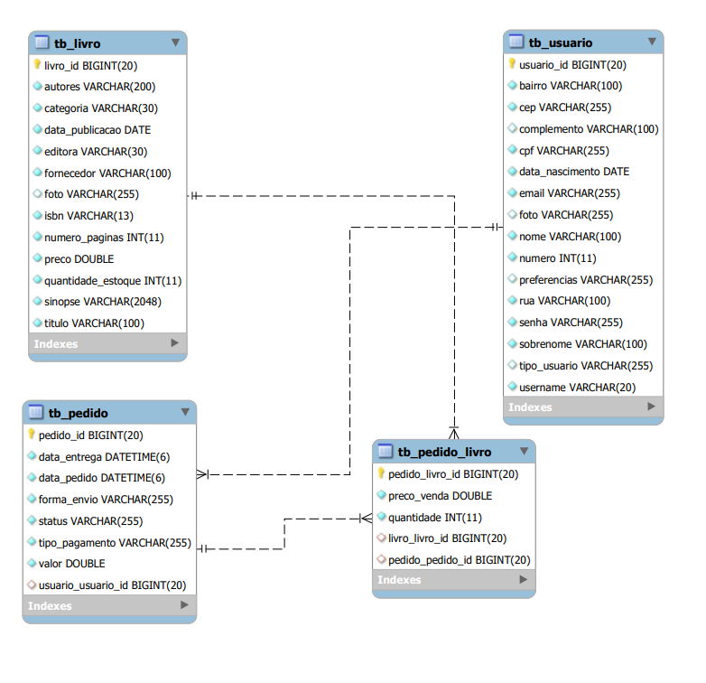

<h2 align="center">PROJETO INTEGRADOR DIGITAL HOUSE-PORTO SEGURO</h2>
    <h5>E-commerce desenvolvido como projeto final do curso java fullstack, com aulas ministradas pelo professor Luis Guerreiro e Leandro Sodré pela Digital House.</h5>
 

    <h1 align="center">The Book Club</h1>
    <h6 align="center">A loja perfeita para os amantes de livros</h6>

  

 

   

No inicio do curso tinhamos expectativa de que este trabalho fosse totalmente vinculado a uma das ODS da ONU (você pode ver quais são nesse site: https://brasil.un.org/pt-br/sdgs). Porém essa expectativa foi adaptada a um e-commerce que acreditamos colaborar com as ODS:

<ul>
    <li>12-Consumo e produção responsáveis</li>
    <li>17-Parcerias e meios de implementação</li>
</ul>

    Em um mundo cada vez mais conectado,  o desapego aos velhos e queridos livros tornou-se comum. Pensando em formas de incentivar a leitura e tornar a compra de livros algo interativo e prazeroso, criamos o "The Book Club"!

    O The Book Club é uma livraria virtual, prática e de fácil interação, que permite aos leitores navegarem por suas categorias preferidas, além de ficarem por dentro daquilo que está bombando no universo da literatura! 

    Nesse e-commerce o usuario tem a opção de:
    <ul>
        <li>Fazer uma conta, com usuario e senha, para efetuar compras</li>
        <li>Pesquisar produtos por nome ou categoria</li>
        <li>Colocar produtos em um carrinho de compras</li>
        <li>Realizar a compra</li>
        <li>Realizar login com senha</li>
    </ul>    

 

## ⚙️ Features

- [x] Página individual do produto(livro)
- [x] Página inicial com navbar e botão de login e cadastro
- [x] Autenticação de usuário 
- [x] Cadastro de produtos 
- [x] Cadastro de usuário

 

## 🎨 Layout

  

  

    O projeto foi desenvolvido em JAVA, usando Maven e Angular. No Backend temos a estrutura do banco de dados relacional:

  
    

 
 

   
   ## Tecnologias utilizadas:
<ul>
        <li>Java 17</li>
        <li> Maven Apache 4.0.0</li>
        <li> Spring Boot Starter Parent 2.6.7</li>
        <li> Spring Boot Starter Data JPA</li>
        <li> Spring Security</li>
        <li>Apache Commons Codec</li>
        <li>Spring Boot Starter Validation</li>
        <li>Spring Boot Starter Web</li>
        <li>Spring Boot Devtools</li>
        <li>Jdbc</li>
        <li>Spring Boot Starter Test </li>
        <li>Spring Boot Maven Plugin</li>
        <li>Bootstrap</li>
        <li>Angular</li>
</ul>

## Pré requisitos:

    Para rodar op código de forma local é necessário ter o nvm instalado assim como todas as dependencias citadas acima.

  

<h4 align="center">Colaboradores: </h4>

<table>
<tr>
<td align="center"><a href="https://github.com/adriellebs"> <b>adriellebs</b></a> </td>

<td align="center"><a href="https://github.com/carollmbg"> <b>carollmbg</b></a> </td>

<td align="center"><a href="https://github.com/drishaolin"> <b>drishaolin</b></a> </td>

<td align="center"><a href="https://github.com/ghsoares"> <b>ghsoares</b></a> </td>

<td align="center"><a href="https://github.com/letoffoli"> <b>letoffoli</b></a> </td>

<td align="center"><a href="https://github.com/luanatenguan"> <b>luanatenguan</b></a> </td>
 

<td align="center"><a href="https://github.com/Temgi"> <b>Temgi</b></a> </td>

</tr>
</table>
